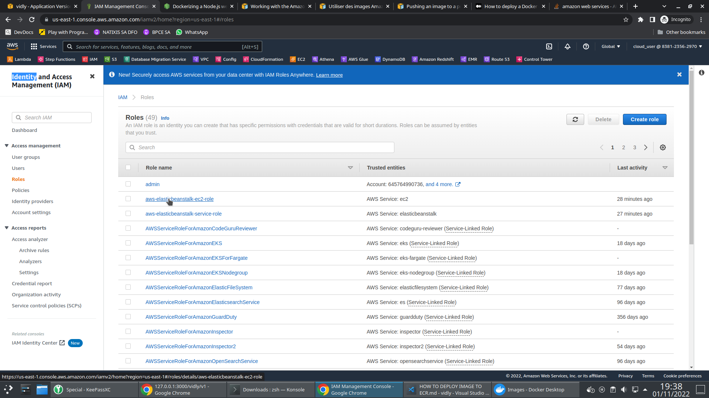
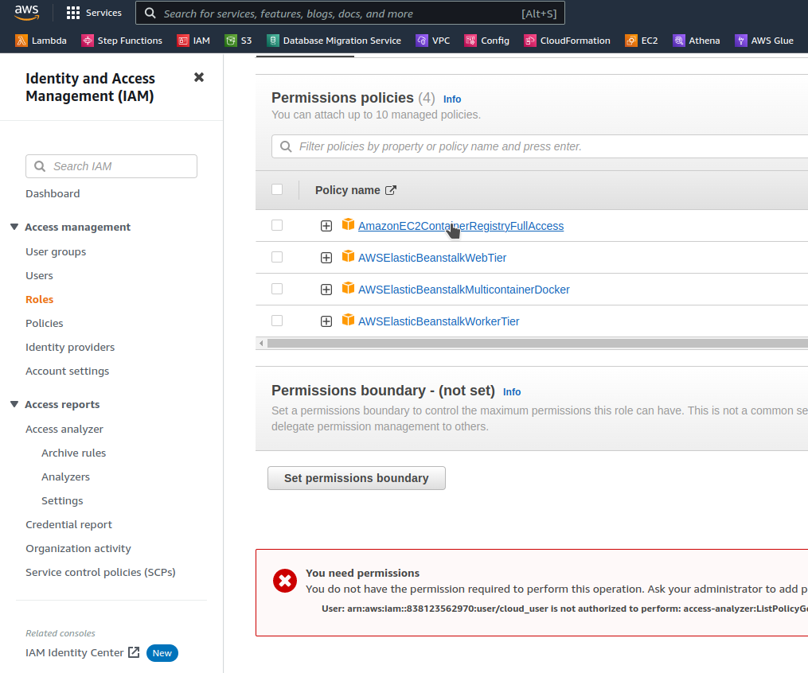

# HOW TO DEPLOY IMAGE TO ECR

- dockerize application [https://nodejs.org/en/docs/guides/nodejs-docker-webapp/](https://nodejs.org/en/docs/guides/nodejs-docker-webapp/)

- be authenticated on Docker Desktop

- deploy on Amazon ECR [https://docs.aws.amazon.com/toolkit-for-vscode/latest/userguide/ecr-working.html#prereqs-vscode-ecr](https://docs.aws.amazon.com/toolkit-for-vscode/latest/userguide/ecr-working.html#prereqs-vscode-ecr)

```sh
# aws ecr get-login-password --region region | docker login --username AWS --password-stdin AWS_account_id.dkr.ecr.region.amazonaws.com
aws ecr get-login-password --region us-east-1 | docker login --username AWS --password-stdin 838123562970.dkr.ecr.us-east-1.amazonaws.com
```

```sh
# docker tag hello-world:latest AWS_account_id.dkr.ecr.region.amazonaws.com/hello-world:latest
docker tag vidly:latest 838123562970.dkr.ecr.us-east-1.amazonaws.com/vidly:latest
```

```sh
# docker push AWS_account_id.dkr.ecr.region.amazonaws.com/hello-world:latest
docker push 838123562970.dkr.ecr.us-east-1.amazonaws.com/vidly:latest
```

- add Role to user IAM
  - AmazonEC2ContainerRegistryFullAccess
  - 
  - 
